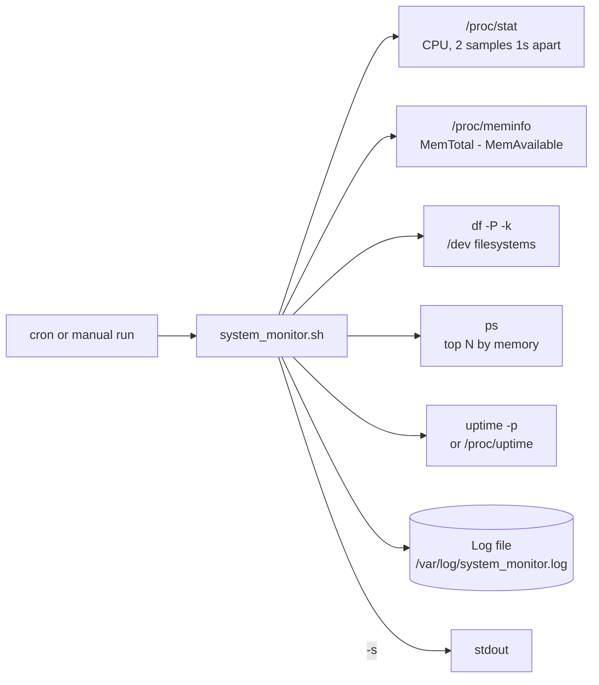

# System-Resource-Monitoring-Script

This project is a shell script that monitors system resources such as CPU usage, memory usage,
and disk space. It writes a report to a log file and can be scheduled to run at regular
intervals using cron jobs.

## Goal

Collect a small, readable health snapshot of a Linux server on a schedule, with no agent to
install. Useful on servers that have no monitoring agent yet, or as a quick audit trail.

## Features

- Logs CPU usage (measured over 1 second)
- Displays memory and disk utilization
- Lists the top 5 memory-consuming processes (change with `-n`)
- Captures system uptime
- Outputs all data to `/var/log/system_monitor.log` (change with `-l` or `SYSTEM_MONITOR_LOG`)
- Can be automated with cron jobs for daily reporting
- `--help`, input checks and clear exit codes

## How it works



## Requirements

- Linux (the script reads `/proc`). macOS is **not** supported: it has no `/proc` and
  different `ps`/`df` options.
- Bash 4+
- Basic command-line tools: `awk`, `df`, `ps`, `sort`, `date` (procps). Works with GNU tools and
  with BusyBox (Alpine).
- Root (sudo) only if you write to `/var/log`.

## Commands Used

- `/proc/stat` - CPU usage. Two samples 1 second apart give the busy percentage.
  (The first version parsed column 8 of `top`, which breaks when a value reaches 100.0
  or the `top` layout is different.)
- `/proc/meminfo` - memory usage. Used = MemTotal - MemAvailable, the same as modern `free`.
- `df -P -k` - disk space of real `/dev/...` filesystems, each device counted once
  (replaces the GNU-only `df --total`).
- `ps -eo pid,comm,%mem,%cpu --sort=-%mem` - top processes (BusyBox fallback: sort by RSS).
- `uptime -p` - system uptime (fallback: `/proc/uptime`).

## Files

| File | Purpose |
| --- | --- |
| `system_monitor.sh` | The monitoring script |
| `README.md` | This file |

## Commands to Run the Script

```bash
chmod +x system_monitor.sh

# Show help
./system_monitor.sh -h

# Run the Script (writes to /var/log, so it needs sudo)
sudo ./system_monitor.sh

# Or write to a file you own and also print the report
./system_monitor.sh -l ./system_monitor.log -s

# View the Logs
cat /var/log/system_monitor.log
```

Options:

| Option | Meaning |
| --- | --- |
| `-l FILE` | Log file (default `/var/log/system_monitor.log`, or `SYSTEM_MONITOR_LOG`) |
| `-n NUM` | Number of top memory processes (default 5) |
| `-s` | Also print the report to stdout |
| `-h` | Help |

Exit codes: `0` ok, `1` runtime error (for example the log file is not writable),
`2` usage error, `3` missing tool or not Linux.

### Automate via Cron

To schedule automatic daily system checks at 8 AM, open root's crontab:

```bash
sudo crontab -e
```

and add this line (replace `/path/to/system_monitor.sh` with the actual path to the script):

```text
0 8 * * * /path/to/system_monitor.sh
```

Tip: rotate the log with logrotate so it does not grow forever, for example
`/etc/logrotate.d/system_monitor`:

```text
/var/log/system_monitor.log {
    weekly
    rotate 8
    compress
    missingok
    notifempty
}
```

## Output Log File: /var/log/system_monitor.log

Sample output from a real run on the test machine (Ubuntu 22.04, 2026-10-02; log path shortened):

```text
$ ./system_monitor.sh -l ./system_monitor.log -s
----------------------------------------
System Resource Report - 2026-10-02 22:45:54
----------------------------------------
CPU Usage:
CPU Load: 5.1%

Memory Usage:
Used: 13.5Gi / Total: 23.2Gi (58.31%)

Disk Usage:
Used: 281G / 467G (64% used)

Top 5 Memory Consuming Processes:
    PID COMMAND         %MEM %CPU
 766679 code             3.3  1.3
 233374 chrome           2.9  1.7
 233960 chrome           2.2  0.2
1334859 chrome           2.0  0.3
 233630 chrome           2.0  0.1

System Uptime:
up 5 days, 11 hours, 11 minutes
----------------------------------------
Report saved to ./system_monitor.log
```

## How to verify

```bash
./system_monitor.sh -l /tmp/check.log -s   # prints the report, exit code 0
echo $?                                     # 0
./system_monitor.sh -n abc; echo $?         # usage error -> 2
./system_monitor.sh -l /root/x.log; echo $? # as a normal user -> 1, clear error message
```

## Clean up

```bash
rm -f ./system_monitor.log /tmp/check.log
sudo crontab -e   # remove the line if you added it
```

## Troubleshooting

| Problem | Fix |
| --- | --- |
| `cannot write /var/log/system_monitor.log` | Run with `sudo`, or use `-l` with a path you own. |
| `this script needs Linux /proc` | You are on macOS or another OS without `/proc`. Run it on Linux. |
| `missing command: ps` | Minimal images (for example `debian:slim`) have no procps: `apt-get install -y procps`. |
| `Disk: n/a (no /dev filesystems found)` | Only seen when no filesystem is on a `/dev/...` device (some containers, ZFS-only hosts). |
| Nothing happens in cron | Use full paths, check `grep CRON /var/log/syslog`, and check root's mail for errors. |

## Tested

Run on 2026-10-02:

- `shellcheck` 0.10.0: no findings.
- Ubuntu 22.04 host, Bash 5.1: report written, exit `0`; `/var/log` without sudo -> exit `1` with
  a clear message; `-n x` -> `2`; unknown option -> `2`; `-h` -> `0`.
- Same run with an empty cron-like environment (`env -i PATH=/usr/bin:/bin`): works.
- `bash:5.2` Docker image (Alpine, BusyBox tools): works, uses the BusyBox `ps` fallback.
- `debian:12-slim` Docker image: exits `3` with `missing command: ps` (no procps installed), as designed.

Not tested: macOS (not supported), the real crontab entry (the command was run by hand).

## Interview talking points

- **Measure, do not scrape.** Reading `/proc/stat` twice is more reliable than parsing `top`,
  whose columns move between versions and locales.
- **Units bug.** The first version divided `free -h` strings (`800Mi / 15Gi`), which gives
  wrong percentages when units differ. Always compute on raw numbers, format at the end.
- **`pipefail` traps.** `ps | head -6` can make `ps` die with SIGPIPE (exit 141) under
  `set -o pipefail`; reading all input with `awk 'NR<=6'` avoids it.
- **Portability.** Fallbacks for BusyBox (`ps` without `--sort`, no `uptime -p`, no `df --total`)
  let the same script run in Alpine containers.
- **Scope.** This is a snapshot logger, not monitoring. For alerting and history you would ship
  metrics to CloudWatch, Prometheus node_exporter or Splunk.
