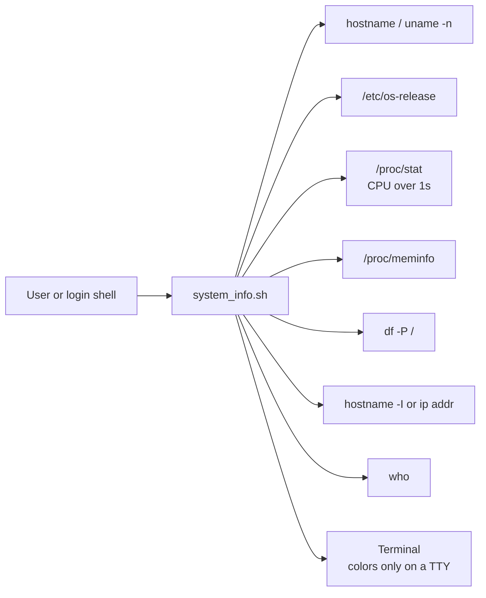

# Linux System Information Tool

A small script that prints a colorized summary of a Linux machine: hostname, OS, uptime,
CPU, memory, disk, IP address and logged-in users.

## Goal

Give a quick "where am I and how healthy is this box" view when you log in to a server,
for example from `~/.bashrc` or as the first command in a troubleshooting session.

## How it works



## Prerequisites

- Linux with `/proc` and Bash 4+. Works with GNU tools and with BusyBox (Alpine).
- No root needed.

## Commands Used

- `hostname` - to get the system's hostname (fallback: `uname -n`)
- `/etc/os-release` (`PRETTY_NAME`) - to get the operating system details
  (the old README said `lsb_release -d`, but the script reads `/etc/os-release`, which exists on
  every modern distribution, also when `lsb_release` is not installed)
- `uptime -p` - to check how long the system has been running (fallback: `/proc/uptime`)
- `/proc/stat` - to get current CPU usage (replaces `top -bn1 | grep "Cpu(s)"`, whose
  column layout changes between versions)
- `/proc/meminfo` - to check memory usage (used = MemTotal - MemAvailable, like `free`)
- `df -P /` - to check disk space usage of the root filesystem
- `hostname -I` - to get the IP address (fallback: `ip -4 addr show scope global`)
- `who` - to list logged-in users (counted once per user name)

## Files

| File | Purpose |
| --- | --- |
| `system_info.sh` | The script |
| `README.md` | This file |

## Commands to Run the Script

```bash
chmod +x system_info.sh

# Run the Script
./system_info.sh

# Without colors (also automatic when NO_COLOR is set or output is piped)
./system_info.sh --no-color

# Help
./system_info.sh --help
```

Disk usage is shown in yellow at 75% or more and in red at 90% or more.
Exit codes: `0` ok, `2` usage error, `3` not Linux (no `/proc`).

Sample output from a real run on the test machine (Ubuntu 22.04, 2026-10-02; hostname hidden):

```text
$ ./system_info.sh
==============================
   LINUX SYSTEM INFORMATION
==============================
Hostname: <hostname>
Operating System: Ubuntu 22.04.5 LTS
Uptime: up 5 days, 11 hours, 11 minutes
CPU Usage: 31.2%
Memory Usage: 13.6Gi / 23.2Gi
Disk Usage: 64% (280G / 467G)
IP Address: 192.168.1.11
Logged-in Users: 2
==============================
Last Checked: Friday 02 October 2026 10:45:56 PM IST
==============================
```

## How to verify

```bash
./system_info.sh; echo "exit=$?"                 # exit=0
./system_info.sh --bad; echo "exit=$?"           # exit=2
./system_info.sh | cat -v | grep -c '\^\[' || true   # 0: no color codes when piped
```

## Clean up

Nothing to clean up. The script only reads system information.

## Troubleshooting

| Problem | Fix |
| --- | --- |
| `IP Address: unknown` | Neither `hostname -I` nor `ip` is available or the host has no global IPv4 address. |
| `Logged-in Users: 0` in a container | Containers usually have no login sessions (`who` is empty). |
| Strange `^[[32m` characters | Your terminal does not support colors: use `--no-color` or `NO_COLOR=1`. |
| `this script needs Linux /proc` | Run it on Linux (not macOS). |

## Tested

Run on 2026-10-02:

- `shellcheck` 0.10.0: no findings.
- Ubuntu 22.04 host, Bash 5.1: output above, exit `0`; unknown option -> exit `2`.
- `bash:5.2` Docker image (Alpine, BusyBox tools): works.
- `debian:12-slim` Docker image (no procps installed): works.

Not tested: macOS (not supported), very old distributions without `/etc/os-release`
(the script falls back to `uname -sr`).

## Interview talking points

- **Do not shadow shell variables.** The first version assigned `HOSTNAME`, which Bash already sets.
  Lowercase names for script variables avoid that class of bug.
- **Colors only for humans.** Colors are turned off when output is not a TTY or `NO_COLOR` is set,
  so the output stays clean in logs and pipes.
- **Graceful fallbacks** for minimal images (BusyBox, no `hostname -I`, no `uptime -p`) instead of
  failing under `set -euo pipefail`.
- **Thresholds make output actionable**: disk turns yellow/red, so the important line stands out.
