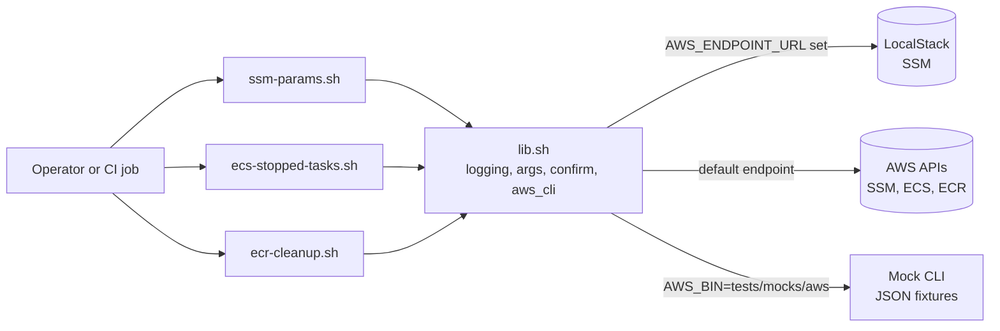
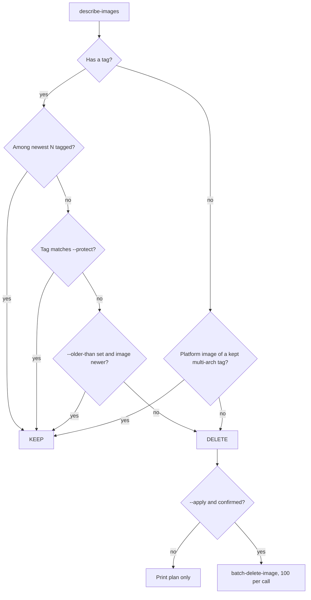

# AWS Ops Toolkit (Bash + AWS CLI)

Small, safe Bash scripts for everyday AWS operations work:

| Script | What it does | Changes AWS? |
| --- | --- | --- |
| `ssm-params.sh` | Export a Parameter Store path to a file, import it into another path, diff two paths or accounts | `import` only, with plan + confirmation |
| `ecs-stopped-tasks.sh` | Report recently stopped ECS tasks per service: stop code, reason, container exit codes | No (read-only) |
| `ecr-cleanup.sh` | Delete untagged images and old images beyond the N most recent | Only with `--apply` (dry run by default) |
| `lib.sh` | Shared logging, argument helpers, confirmation, temp dirs and an `aws` wrapper | - |

## Goal

Show how to write operations scripts that are safe to run in production:

- `set -euo pipefail`, `--help` on every script, clear exit codes.
- Dry run or a plan before any change. A confirmation prompt that refuses to run
  without a terminal (so cron or CI must pass `--yes` on purpose).
- Secrets never printed and never put on the command line.
- `AWS_ENDPOINT_URL` support, so the same scripts run against LocalStack.
- Tests that do not need an AWS account.

## Architecture



How `ecr-cleanup.sh` decides what to delete:



## Prerequisites

- Bash 4+ (Linux, or macOS with `brew install bash`), `jq` 1.6+, `column` (optional, for tables).
- AWS CLI v2. Tested with `aws-cli/2.36.6` installed on the test machine.
  The scripts call `aws` through `AWS_BIN`, so you can point them at another binary.
- For the integration test: Docker and the `localstack/localstack:4.4.0` image.
- IAM permissions (least privilege per script):
  - `ssm-params.sh`: `ssm:GetParametersByPath`, `ssm:PutParameter` (import),
    `kms:Decrypt` / `kms:Encrypt` for SecureString keys, `sts:GetCallerIdentity`.
  - `ecs-stopped-tasks.sh`: `ecs:ListServices`, `ecs:ListTasks`, `ecs:DescribeTasks`.
  - `ecr-cleanup.sh`: `ecr:DescribeImages`, `ecr:BatchGetImage`, `ecr:BatchDeleteImage`.

## Files

```text
project3-aws-ops-toolkit/
├── lib.sh                    # shared helpers (source it)
├── ssm-params.sh             # export / import / diff
├── ecs-stopped-tasks.sh      # read-only ECS report
├── ecr-cleanup.sh            # ECR cleanup, dry run by default
└── tests/
    ├── run-tests.sh          # tiny plain-bash test runner
    ├── helpers.sh            # assertions + mock environment
    ├── mocks/aws             # fake AWS CLI that answers from fixtures and logs calls
    ├── fixtures/{ssm,ecs,ecr}/*.json
    ├── test_*.sh             # 30 offline tests
    └── integration/ssm-localstack.sh   # end-to-end test against LocalStack SSM
```

## Usage

All scripts print logs to stderr and data to stdout, so you can pipe the output.
Common environment variables: `AWS_PROFILE`, `AWS_REGION`, `AWS_ENDPOINT_URL`,
`LOG_LEVEL` (`debug|info|warn|error`), `LOG_FILE` (also append logs to a file).

### ssm-params.sh

```bash
# 1. Export dev (decrypted). The file gets mode 600 and is git-ignored (*.ssm.json).
./ssm-params.sh export --path /myapp/dev --file dev.ssm.json

# 2. Preview an import into staging, then apply it
./ssm-params.sh import --path /myapp/stg --file dev.ssm.json --dry-run
./ssm-params.sh import --path /myapp/stg --file dev.ssm.json --kms-key-id alias/myapp
#    --overwrite also updates parameters that exist with a different value

# 3. Compare two environments (same account or two profiles)
./ssm-params.sh diff --left /myapp/dev --right /myapp/stg
./ssm-params.sh diff --left /myapp/prod --left-profile prod --right /myapp/prod --right-profile dr \
  --right-region eu-west-1

# 4. Delete the export when done
shred -u dev.ssm.json 2>/dev/null || rm -f dev.ssm.json
```

Sample output (run against LocalStack; values are fake):

```text
$ ./ssm-params.sh diff --left /myapp/dev --right /myapp/stg
2026-10-02T17:29:04Z [INFO] ssm-params.sh: AWS identity: arn:aws:iam::000000000000:root via http://localhost:14566
2026-10-02T17:29:04Z [INFO] ssm-params.sh: reading parameters under /myapp/dev
2026-10-02T17:29:05Z [INFO] ssm-params.sh: found 3 parameter(s) under /myapp/dev
...
Diff: left=/myapp/dev  right=/myapp/stg
CHANGED     db/host (String): "db.dev.internal" -> "db.stg.internal"
CHANGED     db/password (SecureString): values differ (use --show-secrets to see them)
ONLY_LEFT   feature/flags (StringList)
Summary: 3 difference(s), 0 identical

$ ./ssm-params.sh import --path /myapp/stg --file dev.ssm.json --dry-run
Plan for /myapp/stg:
  SKIP       /myapp/stg/db/host (String)
  SKIP       /myapp/stg/db/password (SecureString)
  CREATE     /myapp/stg/feature/flags (StringList)
Summary: 1 to create, 0 to update, 0 unchanged, 2 skipped
2026-10-02T17:29:11Z [WARN] ssm-params.sh: 2 parameter(s) already exist with a different value; use --overwrite to update them
2026-10-02T17:29:11Z [INFO] ssm-params.sh: dry run: no changes made
```

`diff` exit codes: `0` identical, `5` differences found. Use it in CI as a drift check.

### ecs-stopped-tasks.sh

```bash
./ecs-stopped-tasks.sh --cluster prod                      # all services, last hour
./ecs-stopped-tasks.sh --cluster prod --service api --since 30m
./ecs-stopped-tasks.sh --cluster prod --json | jq '.[] | select(.stopCode == "TaskFailedToStart")'
```

Sample output (from the test fixtures, not a real cluster):

```text
Stopped tasks in cluster prod, last 1h (newest first)

SERVICE  TASK          TASK_DEF  STOPPED_AT (UTC)      STOP_CODE                  EXIT_CODES            STOPPED_REASON
worker   e5f60718293a  worker:7  2026-09-30T11:55:00Z  EssentialContainerExited   worker=1              Essential container in task exited
api      a1b2c3d4e5f6  api:42    2026-09-30T11:50:00Z  EssentialContainerExited   app=137,log-router=0  Essential container in task exited
api      b2c3d4e5f607  api:42    2026-09-30T11:40:00Z  TaskFailedToStart          app=-                 CannotPullContainerError: pull image manifest has been retried 1 time(s): failed to resolve ref ...
worker   d4e5f6071829  worker:7  2026-09-30T11:30:00Z  ServiceSchedulerInitiated  worker=143            Scaling activity initiated by (deployment ecs-svc/1234567890123456789)

Container details (non-zero or missing exit codes):
  worker e5f60718293a worker: exit=1 (application error)
  api a1b2c3d4e5f6 app: exit=137 (SIGKILL: OOM or killed after stop timeout) reason="OutOfMemoryError: Container killed due to memory usage"
  api b2c3d4e5f607 app: exit=none
  worker d4e5f6071829 worker: exit=143 (SIGTERM: normal stop)

Summary per service:
  api: 2 stopped (1x EssentialContainerExited, 1x TaskFailedToStart)
  worker: 2 stopped (1x EssentialContainerExited, 1x ServiceSchedulerInitiated)
```

Note: ECS keeps stopped tasks for only about an hour. For longer history, send
"ECS Task State Change" events from EventBridge to CloudWatch Logs or Splunk.

### ecr-cleanup.sh

```bash
# Dry run (default): show the plan
./ecr-cleanup.sh --repository myapp --keep 10

# Keep 20, never touch release-* tags, only delete images older than 30 days
./ecr-cleanup.sh --repository myapp --keep 20 --protect '^release-' --older-than 30d

# Really delete (asks for confirmation; add --yes in automation)
./ecr-cleanup.sh --repository myapp --keep 10 --apply
```

Sample output (from the test fixtures):

```text
== app ==
ACTION  DIGEST               TAGS         PUSHED_AT (UTC)       SIZE      REASON
DELETE  sha256:358a566fcab6  v1.0.3       2026-09-03T10:00:00Z  50.5 MiB  beyond newest 10
DELETE  sha256:60adeb44bbc9  v1.0.2       2026-09-02T10:00:00Z  49.6 MiB  beyond newest 10
KEEP    sha256:58a9dfbd5f30  v1.0.1,prod  2026-09-01T10:00:00Z  48.6 MiB  protected tag
KEEP    sha256:5615e95f8eda  <untagged>   2026-09-15T10:00:00Z  45.8 MiB  platform image of a kept multi-arch tag
KEEP    sha256:d485f78b91da  <untagged>   2026-09-15T10:00:00Z  45.8 MiB  platform image of a kept multi-arch tag
DELETE  sha256:184a3c1f0748  <untagged>   2026-08-21T10:00:00Z  42.9 MiB  untagged
DELETE  sha256:b16e0ee07c14  <untagged>   2026-08-22T10:00:00Z  42.9 MiB  untagged
app: 4 to delete (186 MiB), 13 kept

2026-10-02T17:26:13Z [INFO] ecr-cleanup.sh: dry run: 4 image(s) would be deleted. Re-run with --apply to delete them.
```

### Exit codes (all scripts)

| Code | Meaning |
| --- | --- |
| 0 | Success (or `diff`: no differences) |
| 1 | Runtime error (AWS call failed, some deletes failed, bad file) |
| 2 | Usage error (unknown option, missing value) |
| 3 | Missing tool (`aws`, `jq`) or Bash older than 4 |
| 4 | Aborted at the confirmation prompt, or no terminal and no `--yes` |
| 5 | `ssm-params.sh diff` found differences |

## How to verify

Offline tests (mock AWS CLI, no account needed):

```bash
cd project3-aws-ops-toolkit
tests/run-tests.sh          # all tests
tests/run-tests.sh ecr      # only tests with "ecr" in the name
```

End-to-end test of `ssm-params.sh` against LocalStack (community edition has SSM):

```bash
docker run -d --name localstack -p 127.0.0.1:4566:4566 localstack/localstack:4.4.0
AWS_ENDPOINT_URL=http://localhost:4566 tests/integration/ssm-localstack.sh
```

The integration test refuses to run if `AWS_ENDPOINT_URL` is not a local address,
and it uses the fake `test` credentials, so it cannot write to a real account.

## Clean up

```bash
docker rm -f localstack
rm -f ./*.ssm.json
```

## Troubleshooting

| Problem | Fix |
| --- | --- |
| `cannot call AWS (check credentials ...)` | Check `aws sts get-caller-identity`, `AWS_PROFILE` and `AWS_REGION`. For LocalStack set `AWS_ACCESS_KEY_ID=test AWS_SECRET_ACCESS_KEY=test`. |
| `no terminal to confirm ...; re-run with --yes` | Expected in cron/CI. Add `--yes` only after checking the plan (`--dry-run`). |
| `bash 4 or newer is required` | macOS ships Bash 3.2. Install a newer Bash and run `bash ./script.sh`. |
| `... not included in your current license plan` from LocalStack | ECS and ECR are not in LocalStack community. Use the offline tests for those scripts. |
| `jq: error: ... capture/1 is not defined` | Use jq 1.6 or newer. |
| Import into another account fails on SecureString | The target account cannot use the source KMS key. Pass `--kms-key-id` for a key in the target account. |
| `ParameterLimitExceeded` / throttling | The CLI retries with `AWS_RETRY_MODE=standard` and `AWS_MAX_ATTEMPTS=5` (set by `lib.sh`); raise them if needed. |

## Tested

What was run on 2026-10-02 (Ubuntu 22.04, Bash 5.1, jq 1.6, AWS CLI 2.36.6 installed locally;
the `amazon/aws-cli` Docker image was not needed):

- `shellcheck` 0.10.0 on all scripts, tests and the mock: no findings.
- `tests/run-tests.sh`: **30 passed, 0 failed** (lib helpers, SSM, ECS, ECR, with the mock CLI).
  This covers: dry run deletes nothing, `--apply` without a terminal exits 4, the exact
  digests deleted, protected tags, multi-arch child images kept, `--older-than`,
  batching (150 ECS tasks -> 2 `describe-tasks` calls, 250 images -> 3 `batch-delete-image` calls),
  partial delete failure exits 1, secret values never appear in the AWS CLI arguments.
- `tests/integration/ssm-localstack.sh` against `localstack/localstack:4.4.0`
  (container on host port 14566): **7/7 checks passed** - export (mode 600, decrypted),
  import dry run, refusal without `--yes`, import, diff identical (exit 0),
  diff with changes (exit 5, masked), `--show-secrets`, `--overwrite`.
- Checked that LocalStack community 4.4.0 returns "not included in your current license plan"
  for `ecs list-clusters` and `ecr describe-repositories`.

Not tested:

- `ecs-stopped-tasks.sh` and `ecr-cleanup.sh` against real ECS/ECR (needs an AWS account
  or LocalStack Pro). They are tested only with the mock CLI and hand-written fixtures
  that follow the documented API response shapes.
- Cross-account `diff` with two real profiles and cross-account KMS.
- macOS (BSD tools). The tests use GNU `stat -c` and `sha256sum`.

## Interview talking points

- **Safe by default.** ECR cleanup is a dry run unless `--apply`. Imports show a plan first.
  `confirm` refuses to run without a TTY, so automation must say `--yes` on purpose.
- **Secrets hygiene.** Values go to `put-parameter` through `--cli-input-json file://...` in a
  `umask 077` temp dir, so they never show in `ps` or shell history. Diff masks SecureString
  values. Export files are mode 600 and git-ignored. A test checks that no secret reaches the CLI arguments.
- **Multi-arch images.** Untagged platform images that belong to a tagged manifest list look like
  garbage but deleting them breaks `docker pull`. The script reads the index with
  `batch-get-image` and protects them. For steady state, an ECR lifecycle policy is still the
  better tool; this script is for previews and one-off cleanups.
- **Testable without AWS.** All AWS calls go through one wrapper (`aws_cli`), which adds
  `--endpoint-url` and `--region`. Tests swap the binary (`AWS_BIN`) for a mock that serves
  fixtures and logs calls, and pin time with `OPS_NOW`. LocalStack covers what it supports (SSM).
- **Operational details.** API limits handled (100 tasks per `describe-tasks`, 100 images per
  `batch-delete-image`), CLI pagination, standard retry mode, timestamps normalised to UTC
  (jq 1.6 cannot parse offsets, so `lib.sh` has an `epoch` helper), and clear exit codes for CI.
