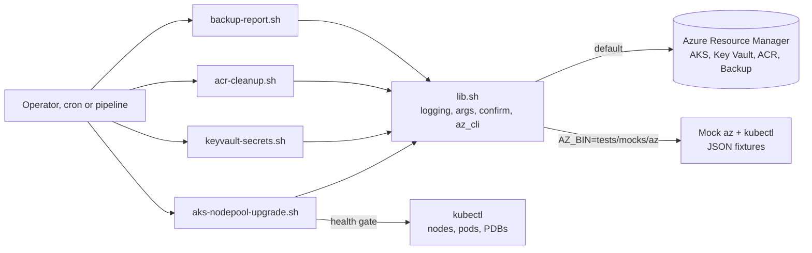
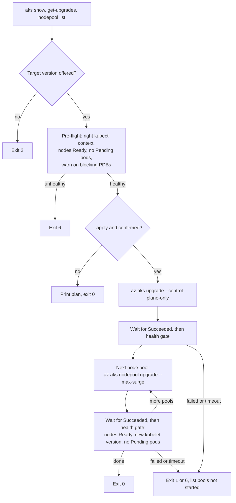

# Azure Ops Toolkit (Bash + Azure CLI)

Small, safe Bash scripts for everyday Azure operations work:

| Script | What it does | Changes Azure? |
| --- | --- | --- |
| `aks-nodepool-upgrade.sh` | Controlled AKS version upgrade: control plane first, then node pools one at a time with max surge and a health gate between steps | Only with `--apply` (dry run by default) |
| `keyvault-secrets.sh` | List/export secret metadata, diff two vaults (dev vs prod), report secrets that expire soon | No (read-only) |
| `acr-cleanup.sh` | Keep the N most recent tagged images per ACR repository, delete older and untagged manifests | Only with `--apply` (dry run by default) |
| `backup-report.sh` | Recovery Services Vault backup jobs of the last N hours per protected item; exit 5 if any failed | No (read-only) |
| `lib.sh` | Shared logging, argument checks, confirmation, temp dirs and an `az` wrapper | - |

## Goal

Show how to write operations scripts that are safe to run in production:

- `set -euo pipefail`, `--help` on every script, clear exit codes.
- Dry run by default for anything that changes or deletes. A confirmation prompt that
  refuses to run without a terminal, so cron or a pipeline must pass `--yes` on purpose.
- Stop at the first problem: the AKS upgrade checks the cluster between every step.
- Secrets never printed, logged or put on a command line unless you ask for it.
- Exit codes that cron, Azure DevOps or a monitoring agent can alert on.
- Tests that need no Azure subscription and no cluster.

## Architecture



How `aks-nodepool-upgrade.sh` moves through an upgrade:



## Prerequisites

- Bash 4+ (Linux, or macOS with `brew install bash`), `jq` 1.6+, GNU `date`, `column` (optional, for tables).
- A recent Azure CLI (`az login`, then `az account set --subscription <id>`). Option names were
  checked against CLI 2.87.0. The scripts log the
  active subscription and identity first, so you always see where they will act.
  The scripts call `az` through `AZ_BIN`, so you can point them at another binary.
- `kubectl` with access to the cluster for `aks-nodepool-upgrade.sh`
  (`az aks get-credentials -g <rg> -n <cluster>`; with Entra ID integration also `kubelogin`).
- Azure RBAC (least privilege per script):
  - `aks-nodepool-upgrade.sh`: Azure Kubernetes Service Contributor on the cluster, plus Kubernetes
    `get`/`list` on nodes, pods and PodDisruptionBudgets in all namespaces (nodes are cluster-scoped,
    so a namespace reader role is not enough).
  - `keyvault-secrets.sh`: Key Vault Reader for metadata; Key Vault Secrets User for
    `--compare-values` / `--show-values` (or `list` / `get` access policies on older vaults).
  - `acr-cleanup.sh`: AcrPull is enough for the dry run; AcrDelete for `--apply`.
  - `backup-report.sh`: Backup Reader on the Recovery Services Vault.

## Files

```text
project3-azure-ops-toolkit/
├── lib.sh                      # shared helpers (source it)
├── aks-nodepool-upgrade.sh     # AKS upgrade, dry run by default
├── keyvault-secrets.sh         # list / export / diff / expiring (read-only)
├── acr-cleanup.sh              # ACR cleanup, dry run by default
├── backup-report.sh            # backup job report (read-only)
└── tests/
    ├── run-tests.sh            # tiny plain-bash test runner
    ├── helpers.sh              # assertions + mock environment
    ├── mocks/az                # fake Azure CLI: answers from fixtures, logs calls, simulates upgrades
    ├── mocks/kubectl           # fake kubectl: nodes, Pending pods, PDBs, kubeconfig server
    ├── fixtures/{aks,keyvault,acr,backup}/*.json
    └── test_*.sh               # 48 offline tests
```

## Usage

All scripts print logs to stderr and data to stdout, so you can pipe the output.
Common environment variables: `LOG_LEVEL` (`debug|info|warn|error`), `LOG_FILE` (also append logs to a file).
In the samples below, log lines are shown without their timestamp and script name.

### aks-nodepool-upgrade.sh

```bash
# 1. See the current versions, node pools and the upgrades AKS offers
./aks-nodepool-upgrade.sh -g rg-aks-prod -n aks-prod

# 2. Plan an upgrade (dry run): shows the steps and runs the read-only pre-flight checks
./aks-nodepool-upgrade.sh -g rg-aks-prod -n aks-prod -k 1.30.4

# 3. Run it: control plane, then every pool one by one (System pools first)
./aks-nodepool-upgrade.sh -g rg-aks-prod -n aks-prod -k 1.30.4 --max-surge 33% --apply

# Or in two change windows: control plane today, node pools tomorrow
./aks-nodepool-upgrade.sh -g rg-aks-prod -n aks-prod -k 1.30.4 --control-plane-only --apply
./aks-nodepool-upgrade.sh -g rg-aks-prod -n aks-prod -k 1.30.4 --nodepools-only --nodepool apps --apply
```

Useful options: `--context` (kubectl context), `--timeout` per operation (default `90m`),
`--settle-timeout` for the health gate (default `10m`), `--drain-timeout` (minutes, passed to AKS).

Sample output (from the test fixtures, not a real cluster). The mock leaves a Pod Pending after
the `system` pool upgrade. The test runs with `--poll-interval 0s --settle-timeout 0s`, so the waits
show 0s; the defaults are 30s and 10m.

```text
$ ./aks-nodepool-upgrade.sh -g rg-aks-prod -n aks-prod -k 1.30.4 --apply --yes --poll-interval 0s --settle-timeout 0s
...
Plan (apply):
  1. control plane 1.29.7 -> 1.30.4 (--control-plane-only)
  2. node pool system 1.29.7 -> 1.30.4, max surge 33%, then health gate
  3. node pool apps 1.29.7 -> 1.30.4, max surge 33%, then health gate
  -  skip node pool batch (stopped; start it or upgrade it later)
Health gate: all nodes Ready and not cordoned, upgraded nodes on v1.30.4, no Pending pods (wait up to 0s)

[INFO] kubectl context matches cluster aks-prod (aks-prod-dns-4f1e2d3c.hcp.westeurope.azmk8s.io)
[WARN] PodDisruptionBudget payments/payments-api-pdb allows 0 disruptions now; it can block node drain
[INFO] health gate (pre-flight): all nodes Ready, no Pending pods
[INFO] upgrading control plane to 1.30.4
[INFO] control plane: Upgrading, checking again in 0s
[INFO] control plane: Succeeded after 0s
[INFO] health gate (after control plane): all nodes Ready, no Pending pods
[INFO] upgrading node pool system to 1.30.4 (max surge 33%)
[INFO] node pool system: Upgrading, checking again in 0s
[INFO] node pool system: Succeeded after 0s
[ERROR] health gate (after pool system) failed after 0s:
[ERROR]   - pod shop/cart-7d9f-abcde is Pending: 0/5 nodes are available: 2 Insufficient memory.
[ERROR] stopping after pool system; not started: apps
```

(Timestamps and the script name are cut from the log lines to keep them short. The exit code is 6.)

### keyvault-secrets.sh

```bash
# Names and metadata only - no values are read
./keyvault-secrets.sh list --vault kv-app-dev
./keyvault-secrets.sh export --vault kv-app-dev --file kv-app-dev.secrets.json   # mode 600, git-ignored

# Drift check between environments (exit 5 when different)
./keyvault-secrets.sh diff --left kv-app-dev --right kv-app-prod
./keyvault-secrets.sh diff --left kv-app-dev --right kv-app-prod --compare-values

# Alerting: exit 5 when a secret is expired or expires within 30 days
./keyvault-secrets.sh expiring --vault kv-app-prod --days 30
./keyvault-secrets.sh expiring --vault kv-app-prod --days 30 --include-no-expiry --json
```

Sample output (from the test fixtures; values are fake):

```text
$ ./keyvault-secrets.sh diff --left kv-app-dev --right kv-app-prod --compare-values
Diff: left=kv-app-dev  right=kv-app-prod  (names, metadata and values)
CHANGED     db-password: value differs
ONLY_LEFT   feature-flag-x
CHANGED     old-token: enabled false -> true; value not compared (disabled)
ONLY_RIGHT  prod-only-key
CHANGED     storage-conn: contentType "text/plain" -> ""
Summary: 5 difference(s), 2 identical

$ ./keyvault-secrets.sh expiring --vault kv-app-dev
Secrets in kv-app-dev that are expired or expire within 30 day(s)
STATUS    NAME         EXPIRES (UTC)         DAYS_LEFT  CONTENT_TYPE
EXPIRED   api-key      2026-09-25T00:00:00Z  -6         -
EXPIRING  db-password  2026-10-10T00:00:00Z  9          -
Summary: 1 expired, 1 expiring, 0 without expiry
```

`--show-values` prints values (`list`), writes them to the file (`export`) or shows the two
values that differ (`diff`). Use it only on your own terminal.

### acr-cleanup.sh

```bash
# Dry run (default): show the plan
./acr-cleanup.sh --registry acrplatform --repository app --keep 10

# Keep 20, never touch release tags, only delete manifests older than 30 days
./acr-cleanup.sh --registry acrplatform --all-repositories --keep 20 --protect '^v[0-9]' --older-than 30d

# Really delete (asks for confirmation; add --yes in automation)
./acr-cleanup.sh --registry acrplatform --repository app --keep 10 --apply
```

Sample output (from the test fixtures):

```text
== acrplatform/app ==
ACTION  DIGEST               TAGS         UPDATED (UTC)         SIZE      REASON
DELETE  sha256:358a566fcab6  v1.0.3       2026-09-03T10:00:00Z  50.5 MiB  beyond newest 10
DELETE  sha256:60adeb44bbc9  v1.0.2       2026-09-02T10:00:00Z  49.6 MiB  beyond newest 10
KEEP    sha256:58a9dfbd5f30  v1.0.1,prod  2026-09-01T10:00:00Z  48.6 MiB  protected tag
KEEP    sha256:9ba1c84e1f98  legacy-1     2026-07-01T10:00:00Z  38.1 MiB  locked (deleteEnabled=false)
KEEP    sha256:5615e95f8eda  <untagged>   2026-09-15T10:00:00Z  45.8 MiB  platform image of a kept multi-arch tag
KEEP    sha256:d485f78b91da  <untagged>   2026-09-15T10:00:00Z  45.8 MiB  platform image of a kept multi-arch tag
DELETE  sha256:184a3c1f0748  <untagged>   2026-08-21T10:00:00Z  42.9 MiB  untagged
DELETE  sha256:b16e0ee07c14  <untagged>   2026-08-22T10:00:00Z  42.9 MiB  untagged
app: 4 to delete (186 MiB), 14 kept

[INFO] dry run: 4 manifest(s) would be deleted. Re-run with --apply to delete them.
```

### backup-report.sh

```bash
./backup-report.sh -g rg-backup -v rsv-prod                 # last 24 hours
./backup-report.sh -g rg-backup -v rsv-prod --hours 48 --json
./backup-report.sh -g rg-backup -v rsv-prod --fail-on-warnings   # also alert on missed backups
```

Cron example (alert when the exit code is not 0):

```text
30 7 * * * /opt/ops/backup-report.sh -g rg-backup -v rsv-prod >/var/log/backup-report.log 2>&1 || /opt/ops/notify.sh "backup failures in rsv-prod"
```

Sample output (from the test fixtures):

```text
Backup jobs in vault rsv-prod (rg-backup), last 24h (since 2026-09-29T12:00:00Z)

STATUS        ITEM          TYPE         LAST_OPERATION  LAST_STATUS            LAST_START (UTC)      OK  WARN  FAILED  RUNNING  ERRORS
FAILED        vm-app-02     VM           Backup          Failed                 2026-09-30T01:05:00Z  0   0     1       0        UserErrorGuestAgentStatusUnavailable
RECOVERED     vm-db-01      VM           Backup          Completed              2026-09-30T10:00:00Z  1   0     1       0        ExtensionSnapshotFailedNoNetwork
LONG_RUNNING  vm-batch-01   VM           Backup          InProgress             2026-09-30T01:00:00Z  0   0     0       1        -
NO_JOB        vm-legacy-01  VM           -               -                      -                     0   0     0       0        -
WARNING       sales         SQLDataBase  Backup          CompletedWithWarnings  2026-09-30T02:00:00Z  0   1     0       0        -
IN_PROGRESS   vm-web-01     VM           Backup          InProgress             2026-09-30T11:30:00Z  0   0     0       1        -
OK            vm-app-01     VM           Restore         Completed              2026-09-30T09:00:00Z  2   0     0       0        -

Failed jobs:
  vm-db-01  Backup  2026-09-29T22:00:00Z  ExtensionSnapshotFailedNoNetwork: Snapshot operation failed due to no network connectivity on the virtual machine.
  vm-app-02  Backup  2026-09-30T01:05:00Z  UserErrorGuestAgentStatusUnavailable: VM Agent unable to communicate with the Azure Backup Service.

Summary: 7 item(s): 1 FAILED, 1 RECOVERED, 1 LONG_RUNNING, 1 NO_JOB, 1 WARNING, 1 IN_PROGRESS, 1 OK
[ERROR] 2 protected item(s) had failed backup jobs in the last 24h
```

### Exit codes (all scripts)

| Code | Meaning |
| --- | --- |
| 0 | Success (no differences, nothing expiring, no failed backups) |
| 1 | Runtime error (az call failed, AKS operation failed or timed out, some deletes failed) |
| 2 | Usage error (unknown option, missing value, version not offered by AKS) |
| 3 | Missing tool (`az`, `jq`, `kubectl`) or Bash older than 4 |
| 4 | Aborted at the confirmation prompt, or no terminal and no `--yes` |
| 5 | Findings: `diff` found differences, `expiring` found secrets, `backup-report` found failed jobs |
| 6 | AKS health gate failed: the upgrade stopped before the next step |

## How to verify

Offline tests (mock `az` and `kubectl`, no subscription or cluster needed):

```bash
cd project3-azure-ops-toolkit
tests/run-tests.sh          # all tests
tests/run-tests.sh aks      # only tests with "aks" in the name
shellcheck -x ./*.sh tests/*.sh tests/mocks/*
```

Against a real subscription, start with the read-only commands: `aks-nodepool-upgrade.sh`
without `-k`, `keyvault-secrets.sh list`, `acr-cleanup.sh` without `--apply`, `backup-report.sh`.

## Clean up

The scripts create nothing in Azure. Remove local files you made:

```bash
rm -f ./*.secrets.json
```

## Troubleshooting

| Problem | Fix |
| --- | --- |
| `cannot use the Azure CLI (run 'az login' ...)` | Run `az login`, then `az account set --subscription <id>`. |
| `kubectl context points at '...', not at cluster ...` | Run `az aks get-credentials -g <rg> -n <cluster>` or pass `--context`. |
| `X is not an available upgrade from Y` | AKS does not skip minor versions. Upgrade one minor at a time; the list shows what is offered. |
| Pool upgrade is slow or stuck on drain | A PodDisruptionBudget with 0 allowed disruptions blocks drain (the pre-flight warns). Fix the PDB or replicas; `--drain-timeout` limits the wait per node. |
| `health gate ... failed` after a pool | Look at the listed nodes and Pods (`kubectl describe`). Fix, then re-run with `--nodepools-only`; pools already on the target are skipped. |
| `no terminal to confirm ...; re-run with --yes` | Expected in cron or a pipeline. Add `--yes` only after checking the dry run. |
| `cannot read secret ... (needs 'get' permission)` | `--compare-values` and `--show-values` need Key Vault Secrets User (or a `get` access policy). |
| `bash 4 or newer is required` | macOS ships Bash 3.2. Install a newer Bash and run `bash ./script.sh`. |

## Tested

What was run on 2026-10-03 (Ubuntu 22.04, Bash 5.1, jq 1.6, Azure CLI 2.87.0 installed locally):

- `shellcheck` 0.10.0 on all scripts, tests and both mocks: no findings.
- `tests/run-tests.sh`: **48 passed, 0 failed** (lib 7, AKS 15, Key Vault 11, ACR 8, backup 7). This covers:
  - dry run is the default and makes no change calls; `--apply` without a terminal exits 4;
  - AKS: control plane before pools, pools one at a time (each waits for Succeeded),
    `--max-surge` and `--drain-timeout` passed through, stop with exit 6 when a node is NotReady
    or a Pod is Pending after a pool, exit 1 on a failed operation or a timeout, wrong kubectl context
    refused, unhealthy cluster never touched, versions not offered rejected;
  - Key Vault: values never in output, logs or `az` arguments without `--show-values` (not even hashes),
    disabled secrets skipped, export file mode 600 and no overwrite without `--force`, exit 5 for diff/expiring;
  - ACR: exact digests deleted, protected/locked/multi-arch platform manifests kept, `--older-than`,
    `--untagged-only`, `--all-repositories`, a failed delete gives exit 1 but the rest continue;
  - backup: status per item, the window filter, the `az` date arguments, exit 5 on failures,
    `--fail-on-warnings`, JSON output.
- `--help` of each script.
- Checked the `az` options used (`aks upgrade --control-plane-only`, `aks nodepool upgrade --max-surge
  --drain-timeout --no-wait`, `acr manifest list-metadata/show/delete`, `backup job list --start-date/--end-date`)
  against `az <command> -h` of CLI 2.87.0, and the backup date parsing against the CLI source.

Not tested:

- Nothing ran against a real Azure subscription or AKS cluster. The fixtures are hand-written
  from the documented `az` output shapes, so field names in real output may differ in edge cases
  (for example other backup workload types).
- The real duration of an AKS upgrade, surge behavior, PDB-blocked drains and API throttling.
- `kubelogin` / Entra ID clusters and private clusters (`privateFqdn` is checked, but not tested live).
- macOS (BSD `date` and `stat`); the scripts use GNU `date -d`.

## Interview talking points

- **Zero-downtime AKS upgrades.** Control plane first (`--control-plane-only`), then one node
  pool at a time with max surge, so there is always spare capacity and a failure hits one pool only.
  Between steps a health gate checks nodes Ready, the new kubelet version and Pending Pods, and the
  pre-flight warns about PodDisruptionBudgets that would block drain. Trade-off: slower than one
  `az aks upgrade` for everything, but each step is visible and you can stop.
- **Safe by default.** Dry run unless `--apply`; `confirm` refuses to run without a TTY; the AKS
  script checks that kubectl points at the same cluster, so it never judges health on the wrong one.
- **Secrets hygiene.** Key Vault values travel only through pipes, never through `az` arguments,
  logs or output. The diff compares SHA-256 hashes in memory and does not print them (a hash of a
  short password can be brute-forced). A test checks for leaks in output and in the call log.
- **Registry hygiene.** Untagged platform images of a multi-arch tag look like garbage, but deleting
  them breaks `docker pull`, so the script reads the index and keeps them. Locked manifests are
  respected. For steady state, a scheduled `acr purge` task or the retention policy is still the
  better tool; this script is for previews and one-off cleanups.
- **Monitoring-friendly reports.** Exit 5 means "findings" (failed backups, expiring secrets,
  drift), separate from 1 (the script itself failed), so cron and pipelines can alert on the right thing.
  `NO_JOB` catches a backup that silently stopped running.
