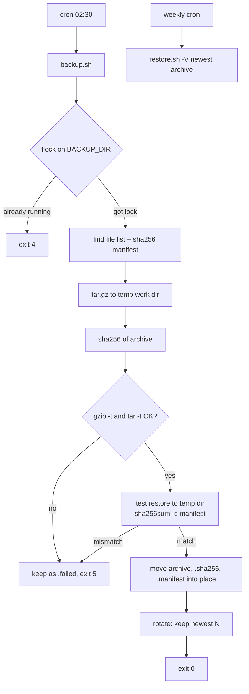

# Backup with Verification

A directory backup script that does not just create archives: it proves each one can be
restored. Every run makes a `tar.gz`, a SHA-256 checksum and a per-file manifest, tests a full
restore, and only then rotates old backups.

## Goal

"A backup you have not restored is not a backup." This project shows a simple, cron-friendly
backup with the checks that are often missing: integrity, restore test, safe rotation and locking.

## Flow



## Prerequisites

- Linux with GNU `tar`, `gzip`, `sha256sum`, `find`, `sort` (coreutils/findutils).
- `flock` (util-linux) is used when present; otherwise a `mkdir` lock is used.
- Bash 4+.

## Files

| File | Purpose |
| --- | --- |
| `backup.sh` | Create, verify, restore-test and rotate backups |
| `restore.sh` | Verify a backup (`-V`) or restore it into a directory |
| `cron.example` | Daily backup and weekly verify crontab lines |
| `tests/run-tests.sh` | 26 plain-bash tests in a temp dir |

Each backup is three files:

```text
app-data-20261002T173219Z.tar.gz          # the archive (UTC timestamp, sorts by time)
app-data-20261002T173219Z.tar.gz.sha256   # checksum, for 'sha256sum -c'
app-data-20261002T173219Z.manifest        # sha256 of every file, checked after restore
```

## Usage

```bash
# Back up /srv/app-data into /var/backups/app-data, keep 14, skip ./tmp
./backup.sh -s /srv/app-data -d /var/backups/app-data -k 14 -e './tmp/*' -l /var/log/backup.log

# Verify the newest backup without restoring it
./restore.sh -V -a "$(ls -1 /var/backups/app-data/app-data-*.tar.gz | tail -n 1)"

# Restore into an empty directory
./restore.sh -a /var/backups/app-data/app-data-20261002T173219Z.tar.gz -t /tmp/restore
```

`backup.sh` options: `-s` source, `-d` backup dir, `-k` keep (default 7), `-n` name prefix,
`-e` exclude glob (repeatable), `-l` log file, `-R` skip the restore test, `-h` help.

Exit codes:

| Code | `backup.sh` | `restore.sh` |
| --- | --- | --- |
| 0 | backup created and verified | restored / verified |
| 1 | backup failed (tar error, unreadable file) | restore failed (target not empty, tar error) |
| 2 | usage error | usage error |
| 3 | missing tool | missing tool |
| 4 | another backup is running (lock) | - |
| 5 | verification or restore test failed | checksum or manifest mismatch |

Sample output from a real run on the test machine (paths shortened):

```text
$ ./backup.sh -s data -d backups -k 3
2026-10-02T17:32:19Z [INFO] backup.sh: backing up .../p4/data -> .../p4/backups/data-20261002T173219Z.tar.gz
2026-10-02T17:32:19Z [INFO] backup.sh: 3 entries to back up (2 regular files)
2026-10-02T17:32:19Z [INFO] backup.sh: restore test passed (2 file checksums match)
2026-10-02T17:32:19Z [INFO] backup.sh: backup ok: .../p4/backups/data-20261002T173219Z.tar.gz (4.0K)
2026-10-02T17:32:19Z [INFO] backup.sh: keeping 1 backup(s) of data

$ ./restore.sh -a backups/data-20261002T173219Z.tar.gz -t restored
2026-10-02T17:32:19Z [INFO] restore.sh: checksum ok: data-20261002T173219Z.tar.gz
2026-10-02T17:32:19Z [INFO] restore.sh: manifest ok: 2 file(s) match
2026-10-02T17:32:19Z [INFO] restore.sh: restored data-20261002T173219Z.tar.gz into restored
```

### Cron

See [cron.example](cron.example). Install it with `crontab -e`. The daily line is silent on
success and prints one line (mailed by cron via `MAILTO`) on failure. A weekly line runs
`restore.sh -V` on the newest archive to catch bit rot on the backup disk.

## How to verify

```bash
cd project4-backup-with-verification
tests/run-tests.sh
```

The tests create sample data (nested dirs, spaces in names, empty file, empty dir, symlink,
random binary), then check rotation, checksums, excludes, restore equality (`diff -r`),
corruption detection, manifest mismatch, lock handling, and that a failed backup never rotates
old backups.

## Clean up

```bash
rm -rf ./backups ./restored     # if you ran the examples inside the repo (both are git-ignored)
crontab -e                      # remove the lines if you installed them
```

## Troubleshooting

| Problem | Fix |
| --- | --- |
| `another backup of NAME is running` | A previous run is still going, or a manual run overlaps cron. Wait, or check `ps`. |
| `could not read all source files` | Permission problem: run as a user that can read every file, or exclude the path with `-e`. |
| `restore test failed ... source changed during backup?` | Files changed between the manifest and the tar step. Stop the writer, use a filesystem/LVM snapshot, or for databases use the database's own dump tool. |
| `backup dir must not be inside the source dir` | Otherwise every backup would include the previous backups. |
| Disk fills up | Lower `-k`, add excludes, or copy backups off the host (S3 with lifecycle rules) and keep fewer locally. |

## Tested

Run on 2026-10-02 (Ubuntu 22.04, Bash 5.1, GNU tar 1.34):

- `shellcheck` 0.10.0 on `backup.sh`, `restore.sh` and the tests: no findings.
- `tests/run-tests.sh`: **26 passed, 0 failed**.
- The two `cron.example` command lines were run by hand with an empty environment
  (`env -i PATH=/usr/local/bin:/usr/bin:/bin`) and paths pointed at a temp dir: both exited `0`
  and printed nothing; `./tmp/*` was excluded.

Not tested: a real crontab install, the `mkdir` lock fallback (the test machine has `flock`),
very large data sets, macOS/BSD tools, off-site copy (not part of the script).

## Interview talking points

- **Verify, then rotate.** Old backups are deleted only after the new one passed checksum, gzip
  and restore checks. A failing job never leaves you with zero good backups.
- **Atomic publish.** Work happens in a temp dir inside the backup dir; the final `mv` is a rename on
  the same filesystem, so readers never see half-written archives.
- **Restore test with a manifest.** Checking `sha256` of the archive only proves the file did not
  change. Extracting and comparing every file with a manifest proves the data can come back.
- **Cron safety.** `flock` prevents overlapping runs, exit codes make failures visible, and output
  is quiet on success so `MAILTO` only mails real problems.
- **Limits.** This is file-level backup. It is not crash-consistent for live databases (use dumps or
  snapshots), and real 3-2-1 needs an off-site copy (for example S3 with Object Lock).
